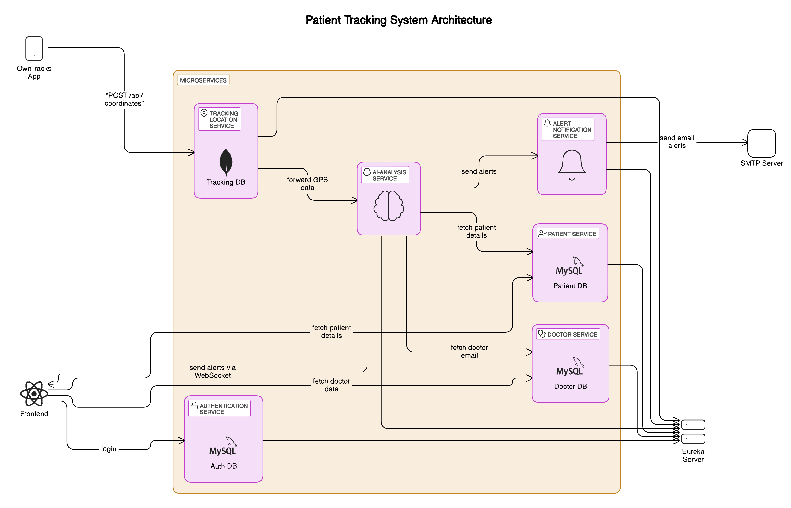
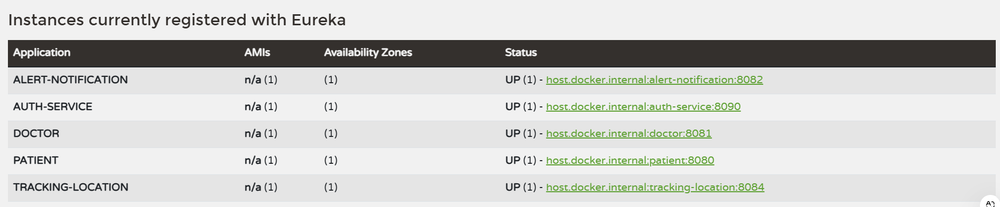

# **Patient Tracking System**

The **Patient Tracking System** is a microservices-based solution designed to monitor patient activity and ensure their safety. This system allows real-time tracking of patients, triggers alerts for inactivity or perimeter breaches, and sends notifications to assigned doctors.

---

## **Features**
- 📍 **Real-Time Location Tracking**: Continuously monitors patients’ locations.
- 🚨 **Inactivity and Perimeter Breach Alerts**: Notifies assigned doctors via email in case of inactivity or if a patient exits a predefined safe zone.
- 📧 **Email Notifications**: Sends detailed alerts to doctors, including patient information and location data.
- 🏥 **Doctor and Patient Management**: Allows CRUD operations for doctors and patients.
- 🔒 **Authentication**: Secures the system using JWT-based authentication.

---

## **System Architecture**



---

## **Technologies Used**

### **Backend Frameworks**
- **Spring Boot** (Java) for microservices.
- **Flask** (Python) for AI Analysis.

### **Communication**
- **REST API**: For inter-service communication.
- **Eureka Service Discovery**: To register and discover services dynamically.

### **Database**
- **MySQL**: For relational data storage (patients, doctors, users).
- **MongoDB**: For location tracking data.

### **Authentication**
- **JWT (JSON Web Tokens)**: For secure authentication and authorization.

---

## **Setup and Installation**

### **Prerequisites**
1. **Java JDK 11+** and **Python 3.9+**
2. **MySQL** and **MongoDB**
3. **Postman** (for API testing)
4. **Maven** (for building Java services)

---

### **Steps to Run Locally**

#### **1. Clone the Repository**
```bash
git clone https://github.com/dalillali/Patient-Tracking-System.git
cd patient-tracking-system
```
#### **2. Start Eureka Server**
Navigate to the eureka-server directory and run:

```bash
mvn spring-boot:run
```

#### **3. Start Microservices**
For Patient Service:

```bash
cd patient-service
mvn spring-boot:run
```

For Doctor Service:

```bash
cd doctor-service
mvn spring-boot:run
```
For Auth Service:

```bash
cd auth-service
mvn spring-boot:run
```
For Location Tracking Service:

```bash
cd location-tracking
mvn spring-boot:run
```
For Alert Notification Service:

```bash
cd alert-notification
mvn spring-boot:run
```
Start AI Analysis Service

```bash
python app.py
```
### **API Requests**
## **Sample Request to Create a Doctor**
```bash
POST http://localhost:8081/api/doctors
Content-Type: application/json

{
  "firstName": "John",
  "lastName": "Doe",
  "specialty": "Cardiology",
  "email": "john.doe@example.com",
  "phone": "+1234567890"
}
```
## **Sample Request to Create a Patient**
```bash
POST http://localhost:8080/api/patients
Content-Type: application/json

{
  "firstName": "Alice",
  "lastName": "Smith",
  "age": 35,
  "address": "123 Main St, Springfield",
  "doctorId": 1
}
```
## **Sample Request to Analyze GPS Data**
```bash
POST http://localhost:5001/analyze
Content-Type: application/json

{
  "latitude": 35.694518,
  "longitude": -2.3641584,
  "timestamp": "2024-12-25T00:00:00Z",
  "trackerId": 1
}
```
## **Eureka Instances**

